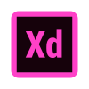

### </Hola Mundo> # Hi there, It's Diany 👋 Junior Front-end Developer

- 👩🏻‍💻 Diseñadora convertida en **desarrolladora de software**, con una pasión por combinar la creatividad con la precisión técnica.

- 👩🏻‍🎓 Mi transición al desarrollo de software es un testimonio de mi **compromiso con el aprendizaje continuo**. Siempre buscando oportunidades para expandir mis **habilidades**.

## 🎯 Currently:  

- 💻 En **busqueda de trabajo como Desarrollador Front End Junior**.
- 🌱 Trabajando en **proyectos personales**.
- 📓 Estoy **aumentando mis conocimientos en TypeScript, Angular y Git**. 
- 📍 Resido en **Madrid**, pero con disponibilidad de trasladarme.

## 🛠️ Languages and Tools :

### Frameworks, Platforms and Libraries:
 

### Languages:

## Code Editor:

### Design: 

### Terminal: 

### Social: 

